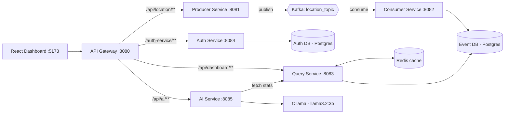

# Stream Analytics

A real-time event analytics platform built as a set of Spring Boot microservices. You send a location event from the dashboard, it travels through Kafka into PostgreSQL, comes back out through a cached query API, and shows up live on a React console. There is also an AI analyst (Spring AI + Ollama) that reads the current numbers and writes a short summary for you.

I built this to learn how the pieces of a real streaming backend fit together: an API gateway, JWT auth, async messaging, caching, and an LLM, all running together with one `docker compose up`.

---

## What it does

1. You sign in on the dashboard (JWT auth).
2. You add a location event from the dashboard, either by picking a preset or typing your own.
3. The event is published to a Kafka topic by the producer service.
4. The consumer service reads it from Kafka and saves it in PostgreSQL with a timestamp.
5. The query service reads the data back and caches the results in Redis.
6. The dashboard polls every few seconds and shows total events, latest events and a per-location breakdown.
7. One click on **Generate Summary** and the AI service pulls the same stats, hands them to a local Llama model and returns a short written summary.

---

## Architecture



The gateway is the only thing the browser talks to. It checks the JWT on every request except login and register, then forwards to the right service.

---

## Tech stack

| Layer | Tech |
|---|---|
| Frontend | React (Vite) |
| Gateway | Spring Cloud Gateway (WebFlux), Spring Security |
| Auth | Spring Boot, Spring Security, JWT (jjwt), BCrypt |
| Messaging | Apache Kafka (with Zookeeper) |
| Storage | PostgreSQL 16 |
| Caching | Redis 7 (Spring Cache) |
| AI | Spring AI, Ollama, `llama3.2:3b` |
| Packaging | Docker, Docker Compose |
| Language | Java 17 |

---

## Services

| Service | Port | What it does |
|---|---|---|
| `api-gateway` | 8080 | Single entry point. Validates JWTs, routes requests, handles CORS |
| `auth-service` | 8084 | Register and login, issues JWTs |
| `producer-service` | 8081 | Receives a location and publishes it to Kafka |
| `consumer-service` | 8082 | Listens to Kafka and stores events in Postgres |
| `query-service` | 8083 | Read API for the dashboard, backed by Redis caching |
| `ai-service` | 8085 | Builds a prompt from live stats and asks the LLM for a summary |
| `dashboard` | 5173 | React console |

Infrastructure containers: `auth-db` (5433), `event-db` (5432), `redis` (6379), `zookeeper` (2181), `kafka` (9092), `ollama` (11434).

---

## API reference

All requests go through the gateway at `http://localhost:8080`. Everything except login and register needs `Authorization: Bearer <token>`.

| Method | Endpoint | Description |
|---|---|---|
| POST | `/auth-service/register` | Create an account. Body: `{ "username": "...", "password": "..." }` |
| POST | `/auth-service/login` | Returns a JWT as plain text |
| POST | `/api/location/update?location=Delhi` | Publish a location event |
| GET | `/api/dashboard/total-events` | Total number of events |
| GET | `/api/dashboard/latest-events` | Last 10 events |
| GET | `/api/dashboard/location-count` | Event count per location |
| GET | `/api/ai/event-summary` | AI-written dashboard summary |

---

## Running it locally

### Prerequisites

- Docker and Docker Compose
- Java 17 and Maven (to build the jars)
- Node 20 (only if you want to run the dashboard outside Docker)

### 1. Clone the repo

```bash
git clone https://github.com/<your-username>/stream-analytics.git
cd stream-analytics
```

### 2. Build every service

Each Java service has a Dockerfile that copies a jar from `target/`, so build them first:

```bash
cd api-gateway && mvn clean package -DskipTests && cd ..
cd auth-service && mvn clean package -DskipTests && cd ..
cd producer-service && mvn clean package -DskipTests && cd ..
cd consumer-service && mvn clean package -DskipTests && cd ..
cd query-service && mvn clean package -DskipTests && cd ..
cd ai-service && mvn clean package -DskipTests && cd ..
```

### 3. Build the Docker images

The compose file expects these image names:

```bash
docker build -t api-gateway-service ./api-gateway
docker build -t auth-service ./auth-service
docker build -t producer-service ./producer-service
docker build -t consumer-service ./consumer-service
docker build -t query-service ./query-service
docker build -t ai-service ./ai-service
docker build -t dashboard ./dashboard
```

### 4. Start everything

```bash
docker compose up -d
```

### 5. Pull the LLM model (first time only)

Ollama starts empty, so download the model once:

```bash
docker exec ollama ollama pull llama3.2:3b
```

### 6. Open the dashboard

Go to **http://localhost:5173**, register an account, sign in, and add your first location.

---

## Adding locations from the dashboard

You don't need Postman. The dashboard has an **Add Location** card:

- Pick a preset city from the dropdown, or choose **Other** and type your own.
- Hit **Send event**.
- The request goes `Dashboard → Gateway → Producer → Kafka → Consumer → Postgres`, and within a few seconds the numbers update on their own.

Locations are limited to 100 characters, matching the database column.

---

## Configuration

Secrets and URLs should come from environment variables, not committed files.

| Variable | Used by | Purpose |
|---|---|---|
| `JWT_SECRET` | gateway, auth-service | Base64 secret for signing and verifying JWTs. **Must be identical in both** |
| `SPRING_DATASOURCE_URL` / `_USERNAME` / `_PASSWORD` | auth, consumer, query | Database connection |
| `SPRING_KAFKA_BOOTSTRAP_SERVERS` | producer, consumer | Kafka address (`kafka:9092` locally) |
| `SPRING_DATA_REDIS_HOST` / `_PORT` | query-service | Redis connection |
| `SPRING_AI_OLLAMA_BASE_URL` | ai-service | Where Ollama is running |
| `QUERY_SERVICE_URL` | ai-service | Where the query service lives |
| `VITE_GATEWAY_URL` | dashboard | Public URL of the gateway |

Generate a fresh JWT secret with:

```bash
openssl rand -base64 32
```

---

## Deploying on Render

Render doesn't run `docker-compose.yml`. Instead, you create each piece as its own service and connect them with environment variables. Here is the plan I follow.

### What maps to what

| Local | On Render |
|---|---|
| `auth-db`, `event-db` | Render PostgreSQL (two databases) |
| `redis` | Render Key Value (Redis-compatible) |
| `kafka` + `zookeeper` | **Not offered by Render.** Use a hosted Kafka such as Redpanda Cloud, Confluent Cloud or Aiven |
| `ollama` | See the note below |
| Java services | One Web Service each, runtime **Docker** |
| `dashboard` | Static Site |

### Step by step

1. **Push the repo to GitHub.**
2. **Make the Dockerfiles self-building.** On Render the jar isn't prebuilt, so use a multi-stage Dockerfile in each Java service:
   ```dockerfile
   FROM maven:3.9-eclipse-temurin-17 AS build
   WORKDIR /app
   COPY pom.xml .
   COPY src ./src
   RUN mvn clean package -DskipTests

   FROM eclipse-temurin:17-jre
   WORKDIR /app
   COPY --from=build /app/target/*.jar app.jar
   ENTRYPOINT ["java", "-jar", "app.jar"]
   ```
3. **Let Spring use Render's port.** In each service's properties, set `server.port=${PORT:8083}` (using that service's default port as the fallback).
4. **Create the databases.** Make two Render Postgres instances (auth and events) and copy their *Internal Database URLs*.
5. **Create Redis.** Make a Render Key Value instance and copy its internal host and port.
6. **Set up Kafka.** Create a cluster on your chosen provider, create the topic `location_topic`, and get the bootstrap server plus credentials. Most hosted Kafka needs extra properties such as `spring.kafka.properties.security.protocol=SASL_SSL`, `sasl.mechanism` and `sasl.jaas.config`.
7. **Deploy the backend services.** For each service click *New → Web Service*, pick the repo, set the root directory to that service's folder, choose Docker, and add its environment variables from the table above. Deploy in this order: auth → producer → consumer → query → ai → gateway.
8. **Point the gateway at the services.** Replace the hardcoded `http://auth-service:8084`-style URIs with environment variables that hold the other services' Render internal URLs.
9. **Set CORS.** Add your deployed dashboard URL to the gateway's allowed origins instead of only `http://localhost:5173`.
10. **Deploy the dashboard.** Create a Render Static Site with root directory `dashboard`, build command `npm install && npm run build`, publish directory `dist`, and set `VITE_GATEWAY_URL` to your gateway's public URL.
11. **Test the whole flow:** register, sign in, add a location, and watch the counters change.

### About the AI service on Render

`llama3.2:3b` needs several GB of RAM and a persistent disk for the model. That does not fit on a free instance. Your options:

- Run Ollama as its own paid service with a disk attached, and point `SPRING_AI_OLLAMA_BASE_URL` at it.
- Swap Ollama for a hosted LLM API by changing the Spring AI starter and config. The rest of the code stays the same.
- Deploy everything else and leave the AI summary as a "local-only" feature.

Free-tier services on Render also spin down when idle, so the first request after a pause can be slow. Check Render's current plan limits before choosing instance types.

---

## Known limitations and what's next

- Locations are free text, so typos create separate entries ("Delhi" vs "delhi"). Normalizing on the producer is on the list.
- The consumer has no dead-letter topic yet, so a bad message gets retried.
- The Kafka topic has one partition, so there is no horizontal scaling of the consumer yet.
- Ideas I want to add: per-user event history, charts over time, streaming AI responses, and a proper Helm or Kubernetes setup.

---

## Project structure

```
stream-analytics/
├── api-gateway/
├── auth-service/
├── producer-service/
├── consumer-service/
├── query-service/
├── ai-service/
├── dashboard/
└── docker-compose.yml
```

(Rename the folders above to match your repo.)

---

## Author

**Arpit Tyagi**

If you find this useful or have suggestions, feel free to open an issue or a pull request.
